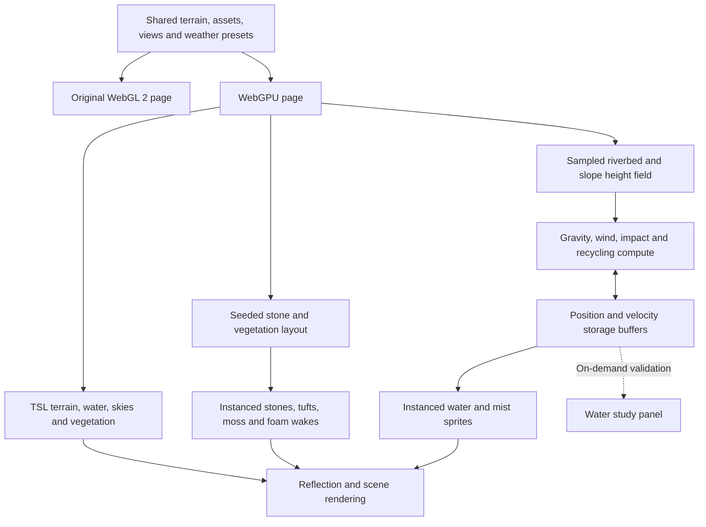

# WebGPU water study — implementation notes

The WebGPU study is the default page at `/`. It extends the Skógafoss scene with native GPU particle simulation and a separate set of Three.js Shading Language (TSL) materials. The original renderer is available at `/webgl.html` for comparison, with a visible version link in each page's header. The old `/webgpu.html` link redirects to `/`, preserving its query parameters and URL fragment. Both scenes and the compatibility redirect are built by Vite; both scenes use the same local photographic assets, terrain, cameras and weather presets. Links remain within the deployment base path when hosted in a subdirectory.

## Run and compare

```sh
npm ci
npm run dev
# Open http://127.0.0.1:5173/ for WebGPU
# Open http://127.0.0.1:5173/webgl.html for the original

npm test
npm run build
npm run preview
# Open the preview URL printed by Vite for the default WebGPU scene
```

Use localhost or HTTPS. The **WebGPU active** badge means the native WebGPU backend initialized; the experiment rejects Three.js's automatic WebGL fallback because its compute path requires WebGPU. A missing adapter, failed initialization or lost device produces a recovery screen linking to the original scene. An embedded browser may defer adapter creation in an inactive tab; open the tab in the foreground and retry.

Both pages start with Clear and Approach. Views 1–5, camera gestures, weather selection, pause and optional synthesized audio work in both versions. Reduced-motion preferences pause animation initially and skip camera/weather transitions.

In **Water study**:

| Control | Purpose |
| --- | --- |
| GPU spray on/off | Hide the particles and stop their compute dispatches; the continuous waterfall and river keep rendering. |
| Wind strength | Multiply the particle simulation's weather-driven wind by 0–4. It does not change the selected sky or simulate a new weather system. |
| Check GPU state | Copy the position and velocity buffers back once and report live populations, height range and simulation steps. |
| Measure 6s | Record whole-scene frame intervals, mean FPS, median and p95. Keep the camera, weather and window size unchanged. |
| Original WebGL2 | Open the original renderer at `/webgl.html`. |

The readback validates finite values, plausible bounds, recognized phases and a nonzero height distribution. Two checks while paused should report the same populations and simulation step count. Readback is deliberately outside the animation loop.

## Renderer and data flow



The original custom GLSL shaders and `onBeforeCompile` hooks could not simply be carried into `WebGPURenderer`; those materials have TSL equivalents. The scene still uses Three.js. TSL generates the shader code for the native backend.

### Simulation

There are 24,576 particle states on the desktop quality path and 12,288 on the coarse-pointer path. Each particle stores two `vec4` values: position plus age, and velocity plus phase. The buffers remain on the GPU between frames.

1. Seed particles across the crest at different ages.
2. Advance falling particles under gravity and weather-dependent wind.
3. Sample the collision height field and turn impacts into short splashes; a smaller fraction becomes drifting mist.
4. Recycle expired or escaped particles at the crest.

A fixed 1/120-second step avoids tying gravity to frame rate. The accumulator caps catch-up at 50 ms per rendered frame, so very slow frames deliberately slow the simulation rather than enqueueing unbounded work. The same paused time uniform drives water, rain, aurora, grass and local wake animations. Weather selection can still transition the lighting while motion is paused.

The 96×96 collision field samples the rendered ground and front slope, with the water surface as a minimum height. The overhead plateau is excluded so it does not form a false collision lid above the falling water.

## River and green-area detail pass

The additional landscape details are specific to the WebGPU page. They reuse existing CC0 textures and add no downloads, services or paid dependencies.

### Stones and water

- Twelve principal boulders interrupt the lower river, with smaller companions and clustered stones along the banks. Stone centers sit below the sampled terrain surface; the submerged parts continue down into the bed.
- Three deformed stone meshes provide shape variation. Photographic rock surfaces, a darker waterline and lower wet-surface roughness help the rocks belong to the water.
- Only sufficiently exposed rocks generate a wake. Thirteen local wake instances contain broken bow foam and downstream streaks, animated using the shared scene clock.
- A wake follows the local direction of the winding river. Its bow anchor is transformed onto the rock position, including the sideways offset on a bend.
- The river shader blends a gravel-colored shallow margin with deeper reflected water and adds restrained moving streaks. This suggests shallows; it is not true underwater refraction or a depth simulation.

### Vegetation and terrain

- Broad meadow-color patches, smaller damp patches, sparse exposed-earth variation and fine grain interrupt uniform green areas while retaining photographic turf detail.
- Curved, tapered grass blades grow in clusters rather than a uniform scatter. Their heights, rotations and colors vary. Each clump has a separate wind phase.
- Low irregular moss cushions follow the local slope and blend into the ground at their edges.
- Placement samples the actual terrain triangles. Slopes that are too steep, river channels and a corridor around the stairs are excluded. Vegetation is illustrative, not a botanical species survey.

Additional instances in the current deterministic layout:

| Detail | Desktop | Coarse pointer |
| --- | ---: | ---: |
| Stream/bank stones | 568 | 212 |
| Local wakes | 13 | 13 |
| Bent-grass clumps | 3,572 | 1,123 |
| Moss cushions | 891 | 282 |

These counts are additional to the original rocks, grass and hikers. Instancing groups them into six additional draws per scene pass; reflections and shadows can add more passes. Principal stream rocks remain in the same positions at both quality levels.

## Where to edit

| File | Responsibility |
| --- | --- |
| `src/gpu/main.js` | Renderer initialization, shared scene assembly, clock and compute loop. |
| `src/gpu/simulation.js` | Particle states, gravity/wind, impacts, recycling and readback validation. |
| `src/gpu/water.js` | Continuous waterfall, upstream flow, reflective lower river and shallows. |
| `src/gpu/materials.js` | Photographic terrain, meadow variation and grass bending. |
| `src/gpu/detail-layout.js` | Deterministic placement, ground normals, river boulder anchors, quality budgets and wake alignment. |
| `src/gpu/details.js` | Stone/grass/moss geometry, instanced materials, wet rock shading and foam wakes. |
| `src/gpu/weather.js` | HDR sky transitions, weather lighting, rain and aurora. |
| `src/gpu/lab.js` | Experiment controls, readback results and frame timing. |
| `src/views.js`, `src/weather-presets.js` | Shared cameras and weather settings. |

For more river rocks, edit the anchors in `createDetailLayout`; check that the new rock emerges above `WATER_LEVEL` before giving it a wake. For denser greens, adjust cluster counts and spread before increasing blade geometry. Preserve the stair exclusion and slope checks. Raising the detail budget costs reflection work and pixel overdraw as well as main-pass geometry.

## Verification

`npm test` covers terrain grounding, the continuous lip, visitors and assets, plus particle readback validation and frame timing. The detail tests check roots against the rendered terrain, keep vegetation off the stairs, verify bow-to-rock alignment on bends, and ensure the low-quality path preserves principal rocks while reducing detail.

A successful Node test run or production build does not compile the actual GPU programs. Also check the browser:

1. Confirm **WebGPU active**, a completed loader and no shader/device errors.
2. Inspect Approach/Riverbed for embedded rocks, attached foam and waterline transitions.
3. Inspect Lookout/Highlands/Valley for vegetation placement, clear stairs and distant color variation.
4. Switch through Clear, Golden, Storm and Aurora; check wetness and lighting on new details.
5. Pause and resume; verify static simulation steps while paused, then increasing steps after resume.
6. Check a narrow viewport and a representative desktop viewport. Profile real phone hardware separately.

A six-second desktop-browser sample after this detail pass measured **46.6 fps**, median **20.7 ms**, p95 **28.0 ms**, at **1280×800**, Clear / Approach, with GPU spray enabled. This is one local sample, not a hardware-independent target or a controlled comparison with the earlier build.

For timing, use the same pixel dimensions, camera, weather and warm-up time. Readback and loading can disturb a sample. Whole-scene FPS is not a GPU compute timing, and spray on/off is not a WebGPU-versus-WebGL comparison. Browser scheduling, other tabs and power/thermal conditions affect results.

## What this does and does not establish

Native GPU compute is useful here for persistent, parallel particle state. The extra rocks, moss, texture variation, instancing and artistic foam could also be built with WebGL; their appearance is primarily a modeling and shading improvement. Switching graphics APIs does not itself make a scene photorealistic.

This remains an artistic reconstruction with composed terrain. The main waterfall is an animated surface. Droplets do not interact with one another, the collision field does not include individual rocks/stairs, and the local foam wakes are positioned visual effects rather than a coupled fluid solver. Planar reflections and TSL material filtering also differ from the original implementation.

References: [Three.js WebGPURenderer](https://threejs.org/manual/pages/webgpurenderer), [TSL](https://threejs.org/docs/pages/TSL.html), [official compute-particles example](https://threejs.org/examples/webgpu_compute_particles.html). Asset provenance is recorded in [ASSETS.md](../ASSETS.md).
