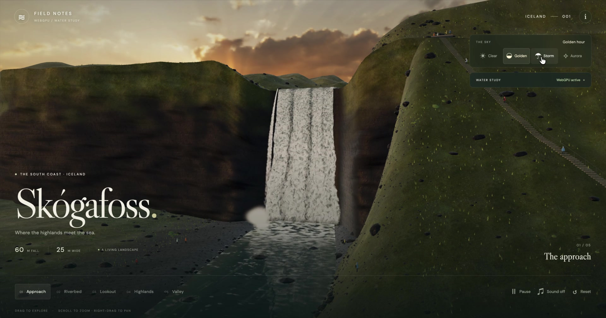
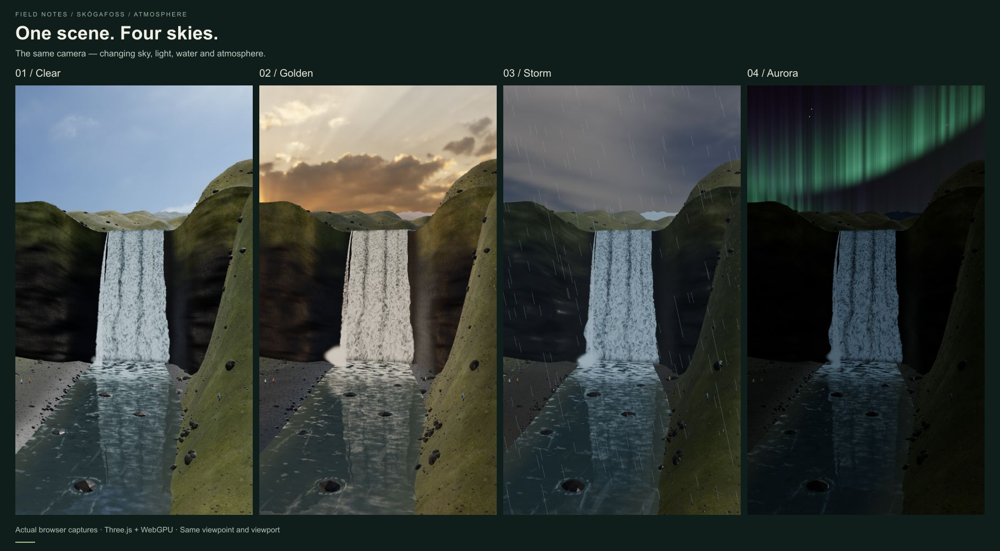
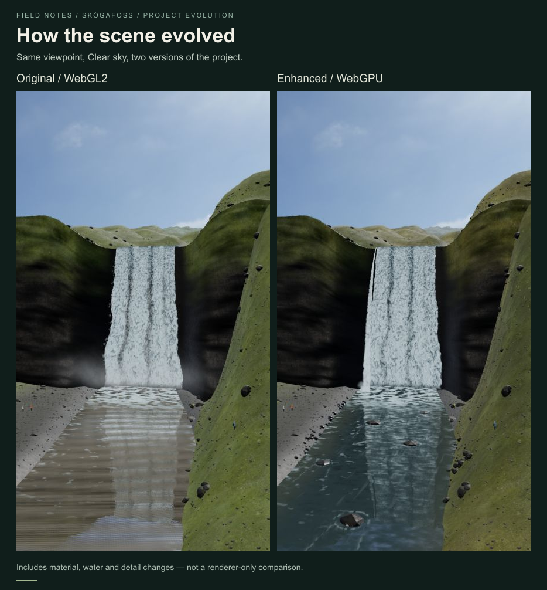
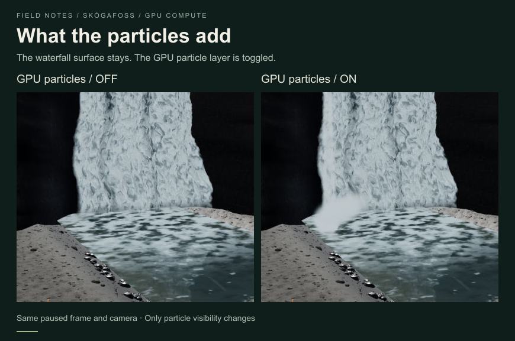
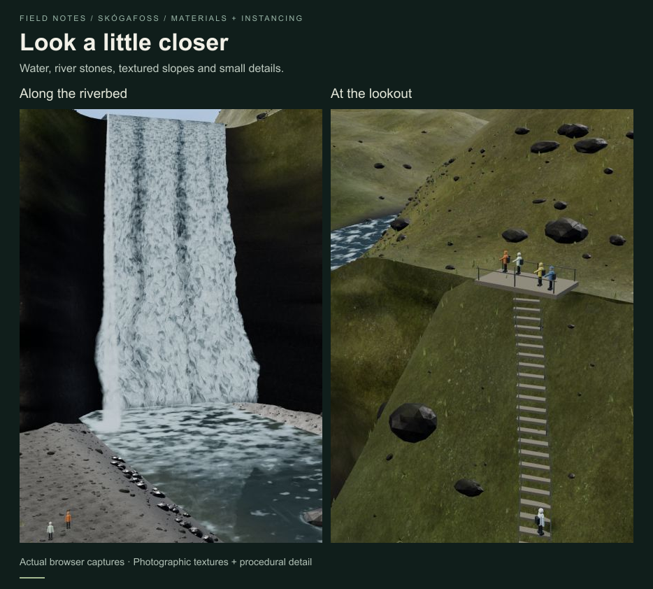

# Skógafoss — demo video and comparisons

Real captures of the running project, prepared for sharing the experiment and what went into it. The PNG cards add captions and layout; their landscape content comes from browser screenshots.

## Demo video

[Watch or download the MP4](skogafoss-twitter.mp4) · [Download the cover image](skogafoss-twitter-cover.jpg)

The user's screen recording, converted to a shareable MP4 without editorial cuts:

- Duration: 25.33 seconds.
- Video: H.264 High, 1920 × 1010, 30 fps, YUV 4:2:0.
- File size: approximately 19.5 MB; no audio track in the original recording.
- Fast-start metadata is at the beginning of the file; the complete video was decoded to check for errors.
- The cover is a separate JPEG from 18.5 seconds, with the same dimensions as the video. It must be selected in the publishing platform; it is not an embedded instruction for the MP4 player.

## 1. Four skies

The same Approach camera and viewport in Clear, Golden, Storm and Aurora modes. The animation continued between captures, so water and particle positions differ. The sky presets also change lighting, water, fog and weather effects.

## 2. Project evolution

The original WebGL2 scene and the enhanced WebGPU study, both in Clear weather from the same camera and viewport. This compares **two project versions**, including material, reflection, particle and landscape-detail changes. It is not a renderer-only comparison or a performance benchmark.

## 3. GPU particle layer

The same paused Riverbed frame with the GPU particles hidden and visible. Only the particle visibility changes; the waterfall surface, river and camera remain fixed. The main waterfall is still an animated surface, not a full fluid simulation.

## 4. Landscape details

Close-ups of the riverbed and lookout showing water, bank stones, textured green slopes, vegetation, stairs and visitors.

## Capture notes

- Source screenshots used the browser's current 433 × 784 viewport. The river/vegetation and particle cards use crops of those screenshots.
- Site controls and overlays were hidden in a temporary capture copy, without changing the project source or scene materials.
- Card dimensions: four skies 1824 × 1006; project evolution 934 × 1006; particles 870 × 577; details 934 × 842.
- These media files are documentation assets, outside `public/`, so they are not automatically included in the website build or downloaded by site visitors.
- See [asset credits](../../ASSETS.md) for the CC0 textures and sky sources used in the scene, and the [WebGPU guide](../WEBGPU.md) for implementation details and limitations.
